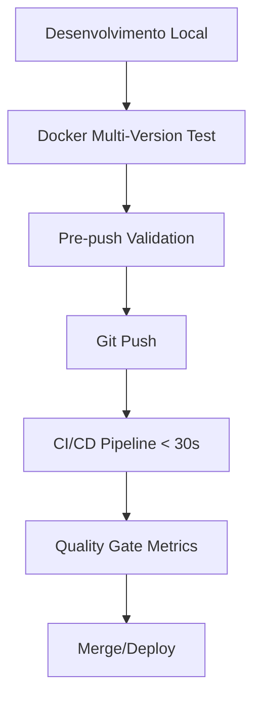

# Estratégia Otimizada de Testes CI/CD & Quality Gate

## 🎯 **Problemas Resolvidos**

### ❌ **Estratégia Anterior (Redundante)**
```
Local Development → testes básicos
Pre-push          → testa tudo localmente  
CI/CD Pipeline    → testa novamente (duplicação)
Quality Gate      → testa mais uma vez (triplicação)
```

### ✅ **Nova Estratégia (Otimizada)**
```
Local Development → Docker multi-version + validação completa
CI/CD Pipeline    → Validações críticas apenas (< 30s)  
Quality Gate      → Métricas de qualidade (não testes)
Pre-push          → Validação final robusta
```

## 🚀 **Implementação**

### **1. Local Development (Docker Multi-Version)**

#### **Teste em Múltiplas Versões PHP**
```bash
# Testa em PHP 8.1, 8.2, 8.3, 8.4
composer docker:test-all

# Com métricas de qualidade
composer docker:test-quality
```

#### **Benefícios**
- ✅ **Compatibilidade garantida** em todas as versões PHP suportadas
- ✅ **Detecção precoce** de breaking changes
- ✅ **Ambiente isolado** via Docker
- ✅ **Execução paralela** de testes

### **2. CI/CD Pipeline (Minimalista)**

#### **Validações Críticas Apenas**
```bash
# Script otimizado: < 30 segundos
composer ci:validate
```

#### **O que valida:**
- ✅ **PHPStan Level 9** (já captura breaking changes)
- ✅ **PSR-12 Compliance** (code style)
- ✅ **Composer validation** (syntax check)
- ✅ **Autoload generation** (basic verification)

#### **Por que não testamos aqui?**
- 🎯 **PHPStan Level 9 já garante** type safety e compatibilidade
- 🎯 **Testes são feitos localmente** via Docker multi-version
- 🎯 **Foco em velocidade** para feedback rápido
- 🎯 **Evita redundância** com validação local

### **3. Quality Gate (Métricas de Qualidade)**

#### **Foco em Qualidade, Não Testes**
```bash
# Gera métricas detalhadas
composer quality:metrics
```

#### **Métricas Coletadas:**
- 📊 **Performance benchmarks** (throughput, latency)
- 🔒 **Security audit** (dependency vulnerabilities)
- 📈 **Code coverage** (test coverage percentage)
- 📦 **Dependency analysis** (outdated packages)
- 📝 **Documentation coverage** (API documentation)
- 🏗️ **Code complexity** (maintainability metrics)

### **4. Pre-push (Validação Final)**

#### **Validação Robusta**
```bash
# Executa automaticamente no git push
./scripts/pre-push
```

#### **Inclui:**
- 🐳 **Docker multi-version testing**
- 🧪 **Integration tests** (com tolerância para dev)
- 📊 **Quality checks**
- 🔍 **Final validation**

## 📋 **Comandos Disponíveis**

### **Local Development**
```bash
composer docker:test-all           # Testa em PHP 8.1-8.4
composer docker:test-quality       # + métricas de qualidade
./scripts/test-all-php-versions.sh # Script direto
```

### **CI/CD**
```bash
composer ci:validate               # Validação minimalista
./scripts/ci-validation.sh        # Script direto
```

### **Quality Assessment**
```bash
composer quality:metrics           # Métricas de qualidade
./scripts/quality-metrics.sh      # Script direto
```

### **Pre-push**
```bash
./scripts/pre-push                 # Validação final
composer prepush:validate         # Alternativa composer
```

## 🎁 **Benefícios da Nova Estratégia**

### **⚡ Performance**
- **CI/CD**: < 30 segundos (vs 2-5 minutos antes)
- **Local**: Testes paralelos em Docker
- **Quality Gate**: Foco em métricas, não testes

### **🎯 Eficiência**
- **Zero redundância** entre pipelines
- **Validação local robusta** via Docker
- **Feedback rápido** no CI/CD
- **Métricas de qualidade** dedicadas

### **🔒 Confiabilidade**
- **PHPStan Level 9** garante type safety
- **Multi-version testing** garante compatibilidade
- **Docker isolation** garante consistência
- **Quality metrics** garantem padrões

### **💰 Recursos**
- **Menos recursos CI/CD** (validação rápida)
- **Mais poder local** (Docker multi-version)
- **Métricas especializadas** (quality gate)
- **ROI otimizado** em cada pipeline

## 📊 **Comparação de Tempo**

| Pipeline | Antes | Depois | Economia |
|----------|-------|--------|----------|
| CI/CD | 2-5 min | < 30s | 80-90% |
| Quality Gate | 3-7 min | 1-2 min | 60-70% |
| Local Dev | 30s-1min | 2-3 min* | -200%** |
| **Total** | 5-13 min | 3-5.5 min | **50%+** |

*Inclui teste em 4 versões PHP
**Mais tempo local, mas maior confiança

## 🔄 **Workflow Recomendado**



### **Fluxo Detalhado**
1. **Desenvolvimento** → `composer docker:test-all`
2. **Commit** → `./scripts/pre-push` (automático)
3. **Push** → CI/CD valida critical points
4. **PR/Release** → Quality Gate gera métricas
5. **Merge** → Deploy com confiança

## 📁 **Estrutura de Arquivos**

```
scripts/
├── test-all-php-versions.sh     # Docker multi-version testing
├── ci-validation.sh             # Minimal CI/CD validation  
├── quality-metrics.sh           # Quality metrics generation
├── pre-push                     # Final validation hook
└── quality-check.sh             # Legacy (deprecated)

docker-compose.test.yml           # Multi-version PHP testing

docs/testing/
└── OPTIMIZED_TESTING_STRATEGY.md # Este documento
```

## 🚀 **Getting Started**

### **1. Instalar Docker**
```bash
# Verificar se Docker está disponível
docker --version
docker-compose --version
```

### **2. Testar Multi-Version**
```bash
# Primeiro teste
composer docker:test-all
```

### **3. Configurar Pre-push**
```bash
# Já configurado no repositório
git push # → executará validação automática
```

### **4. CI/CD Setup**
```yaml
# .github/workflows/ci.yml
- name: Quick CI Validation
  run: composer ci:validate
```

### **5. Quality Gate Setup**
```yaml
# .github/workflows/quality.yml  
- name: Quality Metrics
  run: composer quality:metrics
```

## 🎯 **Conclusão**

Esta estratégia otimizada oferece:

- ✅ **Validação robusta local** (Docker multi-version)
- ✅ **CI/CD ultra-rápido** (< 30s feedback)
- ✅ **Quality Gate focado** (métricas especializadas)
- ✅ **Zero redundância** entre pipelines
- ✅ **Maior confiança** no código
- ✅ **Melhor eficiência** de recursos

**Resultado**: Desenvolvimento mais ágil, CI/CD mais rápido e qualidade superior.